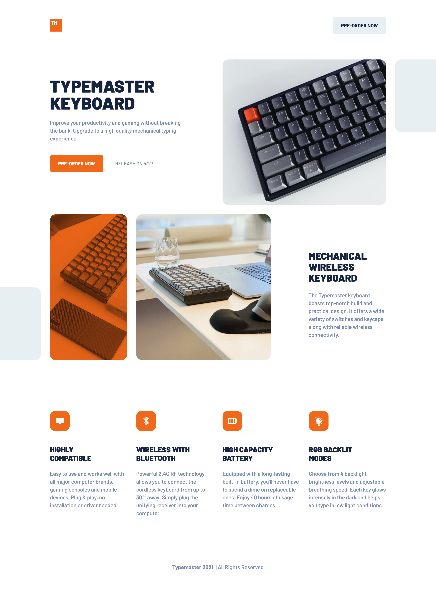
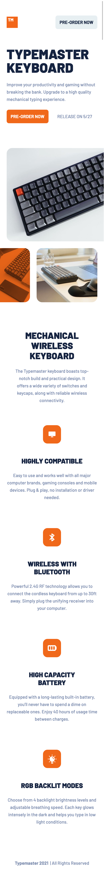

# Frontend Mentor - Typemaster pre-launch landing page solution

This is a solution to the [Typemaster pre-launch landing page challenge on Frontend Mentor](). Frontend Mentor challenges help you improve your coding skills by building realistic projects.

## Table of contents

- [Overview](#overview)
  - [The challenge](#the-challenge)
  - [Screenshot](#screenshot)
  - [Links](#links)
- [My process](#my-process)
  - [Built with](#built-with)
  - [What I learned](#what-i-learned)
- [Author](#author)
- [Acknowledgments](#acknowledgments)

## Overview

### The challenge

Users should be able to:

- View the optimal layout depending on their device's screen size
- See hover states for interactive elements

### Screenshot



<!-- {:height="50%" width="50%"} -->


### Links

- Solution URL: [Solution](https://www.frontendmentor.io/solutions/scss-bem-71-pattern-grids-flexbox-and-parcel-bundler-JQHgS3zGV)

- Live Site URL: [Live Site](https://infallible-varahamihira-5e1530.netlify.app)

## My process

### Built with

- Semantic HTML5 markup
- BEM Methodology
- SCSS
- SCSS 7-1 Pattern
- Flexbox
- CSS Grid
- Desktop-first workflow
- [Parcel](https://parceljs.org/) - Bundler

### What I learned

I learned how to implement responsive images via the picture tag with srcset and media.

### Option:1

```html
<picture class="header__img">
  <source
    media="(min-width: 769px)"
    srcset="assets/desktop/image-keyboard.jpg 1080w"
  />
  <source
    media="(min-width: 768px)"
    srcset="assets/tablet/image-keyboard.jpg 956w"
  />
  <source
    media="(min-width: 375px)"
    srcset="assets/mobile/image-keyboard.jpg 744w"
  />
  
</picture>
```

## Author

- Website - [](www.sergioswork.com)
- Frontend Mentor - [@sergioreynoso](https://www.frontendmentor.io/profile/sergioreynoso)
- LinkedIn - [@sreynoso](https://www.linkedin.com/in/sreynoso/)

## Acknowledgments

I would like to thank [Jonas Schmedtmann](https://codingheroes.io) for all his great [Demy courses](https://www.udemy.com/user/jonasschmedtmann/), as well as [Kevin Powell](https://www.kevinpowell.co) for all the great css content.
